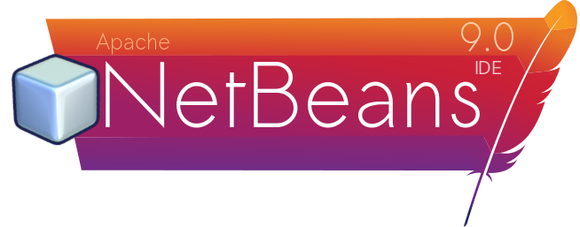
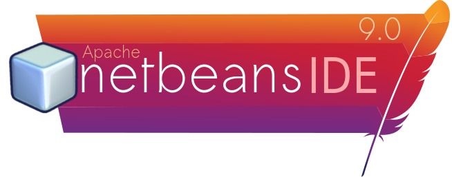
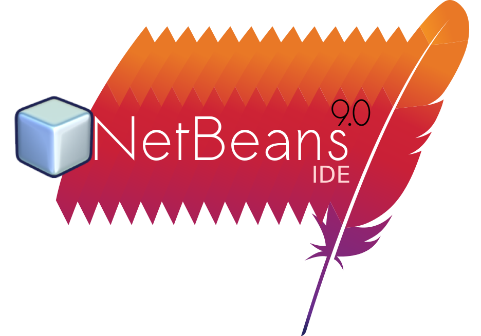

# Possible NetBeans 9.0 Splash screens

In response to the netbeans developer thread  [here](https://lists.apache.org/thread.html/b8d3ede5849a4941f6a52f457da36640d187029490771304749eaff4@%3Cdev.netbeans.apache.org%3E "apache netbeans developer mailing list" )
I have created my own splash screens for the upcoming NetBeans 9.0

Based on the conversations there people are divided on the following choices:

- Those who like the old colorful and vibrant splash screens
- Those who like "modern" flat, bland single color designs, mainly to promote netbeans as modern
- Those who want it to be "netbeans" instead of "NetBeans", or the middle ground of "Netbeans"
- Those that want the Apache feather

My personal preference is colorful, vibrant, non-rectangular frame, with Apache feather.
I have however tried to please most people with these designs

# Recommended

I suggest this one. The blank area at the bottom is good for progress bar and any license information.

This one is a slight variation for those preferring "netbeans".

## Alternative styles

This one is a work in progress. I was trying to get Inkscape's clone tiling tool create patterns but it was buggy.
There also isn't any rectangle below for progress bar

## How to create derivatives

All splashscreens have been generated using Inkscape v0.91. All non original resources like Apache feather and netbeans logo are containd in this repo.
Font used are

- Sawasdee for "Apache", "NetBeans" and "9.0"
- NanumBarunGothic for "IDE"

For those without these fonts (those on Windows), there is a corresponding version with suffix `(path-fonts)` that has the fonts converted to SVG paths.
This means you cant edit the text but it will correctly render without these fonts on your system.